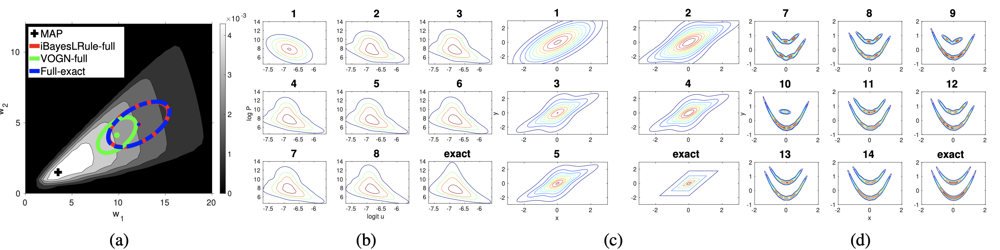

# The Improved Bayesian Learning Rule for Finite Gaussian Mixtures in TensorFlow 2

## What is this?
This is a Tensorflow 2.0 implementation of the Improved Bayesian Learning Rule for Finite Gaussian Mixtures, as proposed by [Lin et al., "Handling the Positive-Definite Constraint in The Bayesian Learning Rule", ICLR 2021](https://arxiv.org/abs/2002.10060).
- [Paper by Lin et al.](https://arxiv.org/abs/2002.10060)
- [Matlab code by original authors](https://github.com/yorkerlin/iBayesLRule)


Plots taken from [the original paper](https://arxiv.org/abs/2002.10060).

## Getting Started
Clone this repository and run
```
pip install . 
```
from the source directory.

To check everything works fine, you can run the tests in ```./i_bayes_rule/tests```.

To get familiar with the code, have a look at the example script ```./scripts/run_i_bayesian_learning_rule.py```.

## Notes
This code is still in development and thus not thoroughly tested. Features may change in the future. It was tested with the packages listed in ```./setup.cfg```.

## License
This code is licensed under the MIT license and is free to use by anyone without any restrictions.

